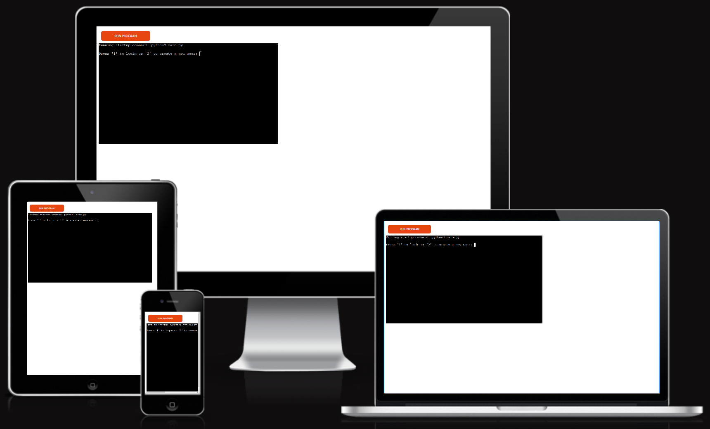
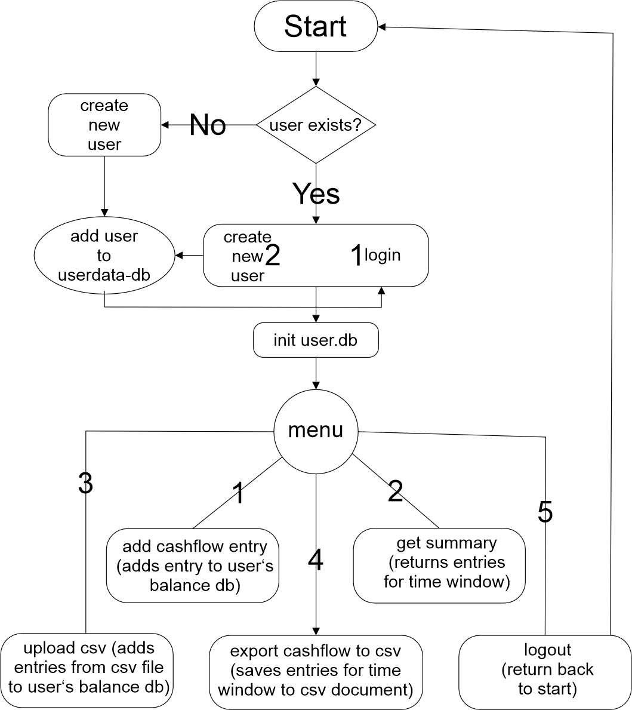

# [Budget Ledger](https://)
(Developer: Damian Droste)

[Page on AmIResponsive](https://ui.dev/amiresponsive?url=https://n4v1ds0n.github.io/tic-tac-toe)

...for your daily transactions, cashflow clarity, and categorical control.

Budget Ledger is a **terminal-based personal finance tracker** built in Python 3, 
designed to help users manage their income and expenses through an intuitive CLI 
interface.

[Link to live CLI deployment (Heroku)](https://budget-ledger-3f04126e52ee.herokuapp.com/)

---

## Index – Table of Contents

- [Planning](#planning)
- [Design](#design)
- [UX](#ux)
  - [Program Goals](#program-goals)
  - [User Stories](#user-stories)
- [Features](#features)
  - [Existing Features](#existing-features)
  - [Possible Future Features](#possible-future-features)
- [Data Model](#data-model)
- [Testing](#testing)
  - [Validator Testing](#validator-testing)
  - [CLI Testing](#cli-testing)
  - [Browser Testing](#browser-testing)
  - [Testing User Stories](#testing-user-stories)
- [Debugging](#debugging)
- [Deployment](#deployment)
- [Credits](#credits)

---

## Planning

The following diagram illustrates the CLI app structure and the program flow for user interaction and database management:

---

## Design

This is a **terminal-only application**, so visual styling is handled through clear, structured text layout and color formatting using `Colorama`.

Menus, user prompts, and outputs are formatted for maximum clarity and usability, even in plain text environments.

---

## UX

### Program Goals

- Allow users to track and manage personal income/expenses
- Secure user data through per-user authentication and individual databases
- Provide a simple CLI menu with options for input, import, summaries and export
- Offer grouping and filtering (e.g., by date or category)

### User Stories

**As a user I want to:**

1. Register and log in with a unique username and password
2. View and manage only my personal financial data
3. Add income and expense records with category, note, and date
4. View a summary of my spending grouped by category or date
5. Export data to CSV within a selected date range
6. View individual transaction records
7. Receive clear prompts and error messages when input is invalid

**As a site administrator I want to:**

8. Ensure each user's data is isolated and stored securely
9. Track user creation and login events via a user database

---

## Features

### Existing Features

- **User Authentication**
  - Secure login with password hashing (SHA-256)
  - Per-user SQLite database (`data/<username>.db`)
  - ensure registrated users exist before allowing login
  - user story 1 covered
- **Individual Databases**
  - initiated upon first login
  - only visible to user
  - user stories 2, 8 covered
- **User Database**
  - stores username and hashed password
  - stores whole userbase
  - user story 9 covered
- **Add Transaction**
  - Record income or expenses
  - Store amount, category, description, timestamp, and date
  - user story 3 covered
- **Import CSV**
  - load csv files from inside the build
  - add entries to user-database
  - user story 3 covered
- **Summarize**
  - Group by `category` or `date`
  - Filter by custom start and end dates
  - user stories 4, 6 covered
- **Export to CSV**
  - Custom date range
  - Clean CSV output with all relevant fields
  - output to folder in build
  - user story 5 covered
- **Clean CLI Design**
  - Modular structure
  - Dynamic menus
  - Helpful validation and input checking
  - user story 7 covered
- **Logout and switch user**
  - user can choose from menu to log out
  - return to login screen
  - user story 1 covered

### Possible Future Features

- Password reset (via CLI or token)
- Budget planning per category
- Weekly or monthly stats overview
- Transaction deletion or editing
- csv import/ export from external sources

---

## Data Model

Here is a representation of the database structures used for this project:

### `user_data` (global users.db)
| Field       | Type    | Notes                     |
|-------------|---------|---------------------------|
| `id`        | INT     | Auto-increment, primary key |
| `username`  | TEXT    | Unique                    |
| `password`  | TEXT    | SHA-256 hashed            |
| `created_at`| TEXT    | ISO timestamp             |

### `balance` (per user .db)
| Field       | Type    | Notes                |
|-------------|---------|----------------------|
| `id`        | INT     | Auto-increment        |
| `amount`    | REAL    | Positive/negative     |
| `category`  | TEXT    | e.g. Food, Salary     |
| `note`      | TEXT    | Optional description  |
| `date`      | TEXT    | YYYY-MM-DD            |
| `timestamp` | TEXT    | Full ISO datetime     |

---

## Testing

### Validator Testing

- **PEP8** compliance ensured using [PEP8 Online](http://pep8online.com/)
- Linter warnings fixed (e.g., spacing, line length)
- CLI-only app; no HTML/CSS validation required

### CLI Testing

Tested on:
| Environment       | Result |
|-------------------|--------|
| VS Code Terminal  | ✔     |
| Heroku deployment | ✔     |

### Browser Testing

Tested on:
| Browser | Layout | Functionality | 
|---------|--------|---------------|
| Firefox | ✔      | ✔            |
| Chrome  | ✔      | ✔            |
| Edge | ✔      | ✔            |

### Testing User Stories

1. register and log in with a unique username and password

| **Feature** | **Action** | **Expected Result** | **Actual Result** |
|-------------|------------|---------------------|-------------------|
| User Authentication | On start screen choose to login or create a new user | reach menu | Works as expected |

Screenshots

| Goal | Outcome |
|------|---------|
| User registration with hashed password | ✔ |
| Login and access personal DB | ✔ |
| Add entry and retrieve it | ✔ |
| Summarize by category/date | ✔ |
| Export filtered data to CSV | ✔ |
| Prevent invalid input | ✔ |

---

## Debugging

### Fixed Bugs

- **Circular import error** when calling `menu()` from `user_management` — fixed by moving all menu calls to `main.py`
- **Missing directory error** when creating user DB — fixed with `os.makedirs()`
- **Unrecognized column 'date'** — resolved by adding proper SQL `DATE()` logic and schema updates

### Unfixed Bugs

None known at time of submission.

---

## Deployment

Deployed to [Heroku](https://heroku.com) using Code Institute’s Python Essentials terminal template.

**Steps to deploy:**
1. Create a Heroku account (if not already existing)
2. Create a new app with Heroku
3. Add Python + Node.js buildpacks (in this specific order)
4. Allowing Heroku access to GitHub, link the new app to the relevant repository
5. Choose whether or not to enable Automatic Deploys. If enabled, the deployed app will update automatically with each push to GitHub
6. Click Deploy

---

## Credits

### Code

- Code Institute’s [Python Essentials Template](https://github.com/Code-Institute-Org/python-essentials-template)
- Copilot used for pair programming

### Acknowledgements

Last but not least I would like to thank :

    My mentor Mo Shami for his very helpful advice and guidance as well as feedback on my work.
    My wife for testing the page now and then.

